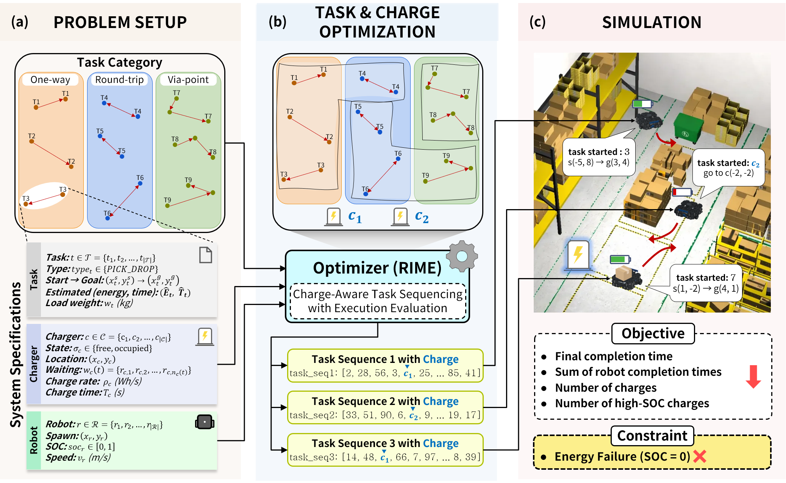

# An integrated framework for joint optimization of task allocation and charging scheduling in multi-robot systems

[](https://docs.ros.org/en/humble/index.html)
[](https://gazebosim.org/)
[](https://hub.docker.com/r/jmk9/mrta-charging-scheduler)

This repository contains the implementation of an integrated framework for **Multi-Robot Task Allocation (MRTA)** and **Charging Scheduling**. By jointly optimizing task sequences and charging maneuvers, this framework minimizes makespan and prevents dock contention in shared infrastructure environments.

## 📺 Demo Video
Check out the simulation demo on YouTube:
<div align="center">
  <a href="https://youtu.be/TR0gkmdvi8w">
    
  </a>
</div>

## 📌 Key Features
- ■ **Jointly optimizes** task assignment, sequencing, and charging under shared docks.
- ■ **Models dock occupancy** and charge-wait to reduce contention-driven delays.
- ■ **Validated in ROS 2 and Gazebo** with execution-level navigation and charging effects.
- ■ **Achieves 7.6% makespan reduction** and 0.8% lower fleet-wide energy consumption compared to heuristic baselines.

## 🏗 System Architecture


## 💻 Environment & Installation
- **OS:** Ubuntu 24.04
- **Middleware:** ROS 2 Humble
- **Docker Image:** `jmk9/mrta-charging-scheduler`

You can run the environment directly using Docker:
```bash
docker pull jmk9/mrta-charging-scheduler
docker run -it jmk9/mrta-charging-scheduler
```

## 🚀 Usage

Before running the project, make sure the required external dependencies are prepared in your ROS 2 workspace.

### 0. Prepare External Dependencies

This project additionally requires the following repositories:

- [`mealpy`](https://github.com/thieu1995/mealpy) for meta-heuristic optimization
- [`aws-robomaker-small-warehouse-world`](https://github.com/aws-robotics/aws-robomaker-small-warehouse-world.git) for the warehouse simulation map

```bash
cd ~/ros2_ws/src

git clone https://github.com/thieu1995/mealpy.git
git clone https://github.com/aws-robotics/aws-robomaker-small-warehouse-world.git

cd ~/ros2_ws
colcon build
source install/setup.bash
```

### 1. Launch Gazebo and Navigation Stack

Execute the multi-robot warehouse world and navigation system:

```bash
ros2 launch turtlebot3_multi_robot gazebo_multi_nav2_world_waypoint.launch.py \
  enable_drive:=True \
  headless:=false \
  num_robots:=4
```

### 2. Run Scheduler Node

Run the optimization-based scheduler using the RIME algorithm:

```bash
ros2 run scheduler scheduler_node_1stage_RIME \
  --ros-args --log-level scheduler_node:=debug \
  -p charge:=optimized \
  --params-file /root/ros2_ws/install/scheduler/share/scheduler/config/scheduler_params.yaml
```

## 📊 Performance Summary

Experimental setup: 4 robots, 50 tasks, and 2 chargers were used in this experiment.  
The 50 tasks consisted of 20 one-way tasks, 15 round-trip tasks, and 15 via-point tasks.

| Policy | Total Length | Total Travel (s) | Total Charge (s) | Total Wait (s) | Total Makespan (s) |
|---|---:|---:|---:|---:|---:|
| Threshold | 56 | 844.68 | 2434.00 | 947.33 | 6604.22 |
| Feasibility | 56 | 896.25 | 2607.26 | 1619.77 | 7500.50 |
| **Optimized (RIME)** | **56** | **855.88** | **1575.03** | **57.20** | **4903.10** |

The optimized policy achieved the lowest total makespan and significantly reduced charger waiting time compared with the threshold-based and feasibility-based baselines.

## 🕒 Scheduling Timeline Comparison

The figure below compares the scheduling timelines of the threshold-based, feasibility-based, and optimized charging policies.  
The optimized policy proactively allocates charging events, which minimizes charger contention and reduces overall mission completion time.


## 👥 Authors

This repository is part of a collaborative research project on multi-robot task allocation and charging-aware scheduling.

- **Minkyu Jung** — first author
- **Hyun Song** — second author
- **Andrew Jaeyong Choi** — corresponding author


